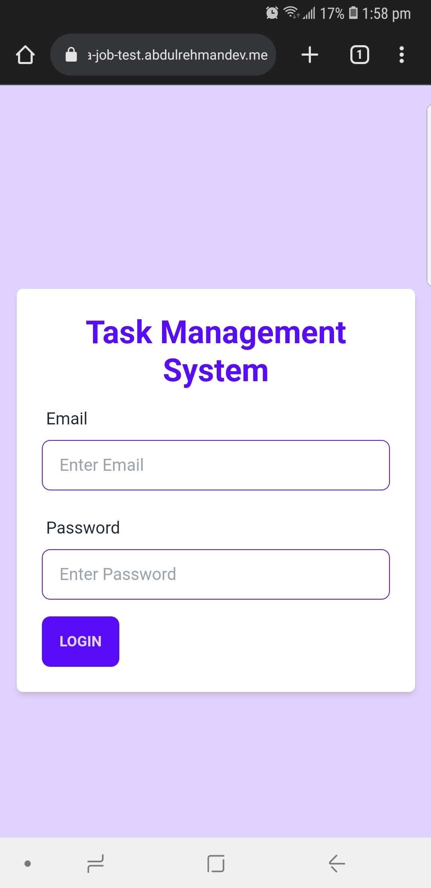
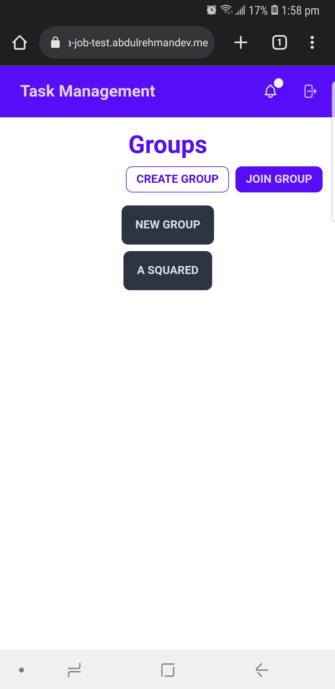
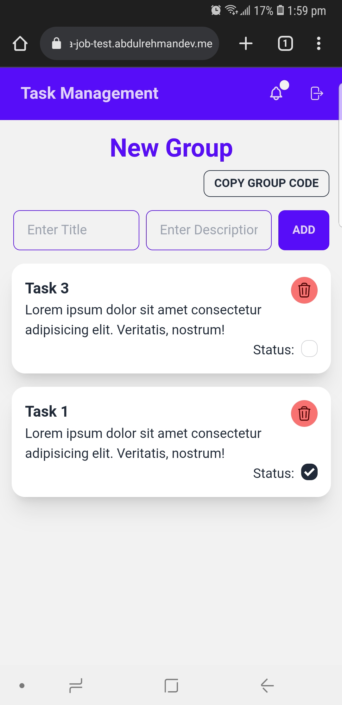

# Task Management System
This is a collaborative tool where users can create and join groups where there are a list of tasks where users mark them as complete. This is a tool that can be used by any group of people who want to keep track of tasks that need to be completed.  
This a project is a React project that uses Firebase as a backend.

## Getting Started
To get started, clone the repository and run `npm install` to install all the dependencies. Then run `npm run dev` to start the development server.
```bash
git clone https://github.com/abdul-rehman-d/technexia-job-test.git
npm install
npm run dev
```

## Features
- User login and preserved session
- Create a group
- Join a group
- Create tasks
- Mark tasks as complete
- Delete tasks
- Rearrange tasks by dragging and dropping

## Screenshots
<div style="display:flex; gap: 5px;">
   <div style="width:33%;">
      <span>Login Page</span>
      
   </div>
   <div style="width:33%;">
      <span>Groups List Page</span>
      
   </div>
   <div style="width:33%;">
      <span>Tasks Page</span>
      
   </div>
</div>

## Live Preview
This Web App is deployed at: [https://technexia-job-test.abdulrehmandev.me/](https://technexia-job-test.abdulrehmandev.me/)
